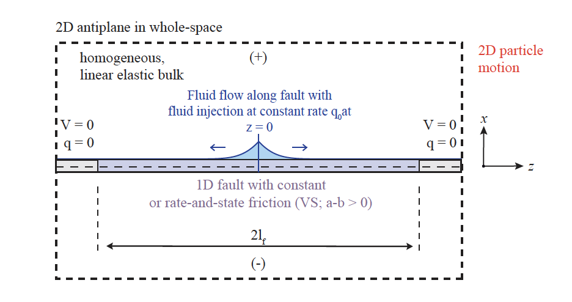

### SEAS Benchmark BP6

The Seismological Grand Challenge in Subduction Megathrust Earthquake Modeling (SEAS) Benchmark Problem 6 (BP6) is a rate-and-state, quasi-dynamic earthquake cycle problem on a 3D dipping fault. This repository includes an example setup and data for BP6 under `example2/`.

- **Objective**: Validate and compare numerical implementations for quasi-dynamic cycles with rate-and-state friction on a geometrically complex fault.
- **What’s included**: Input files, derived profiles, and a reference sketch of the BP6 configuration.
- **Where to start**: See `example2/` for inputs and the mesh, and `src/` for the solver modules.

#### BP6 Configuration Sketch

The sketch illustrates the dipping fault geometry, nucleation region, and boundary conditions typically used for BP6. Use it alongside the files under `example2/` to reproduce the configuration and compare with benchmark outputs.

